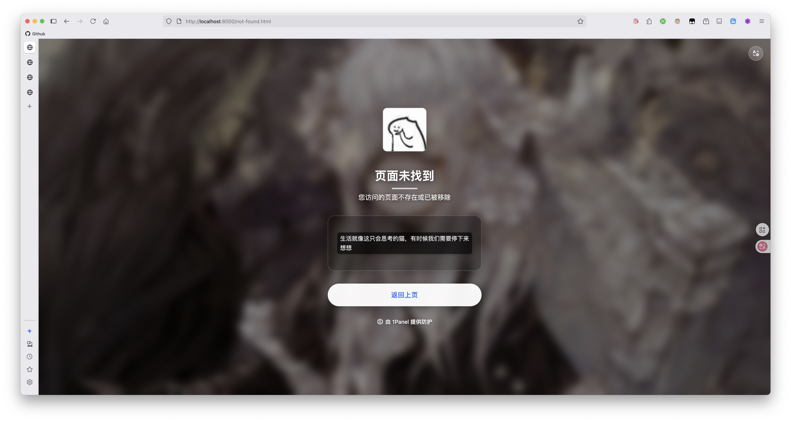

# 1Panel WAF 拦截页面

用于 1Panel WAF 的现代化的拦截页面。

---

## 界面展示 *点击图片查看高清版本*

  
  

  
  

## 🚀 使用方法

### 单页部署
将对应HTML文件部署到WAF拦截规则中：
#### 进入 1Panel 后台界面，在左侧边栏中找到 **高级功能**，随后点击 **WAF** 

#### 找到顶部的 **全局设置** ，点击 **配置** 选项，找到 **拦截界面**，点击对应名称的页面 **编辑按钮** ，粘贴本项目提供的 HTML 文件内容，随后保存即可。

---

## 文件名对应
- **地区限制** - `region_restricted.html` - 访问地区被限制
- **IP封禁** - `ip-blocked.html` - IP地址被封禁
- **访问拒绝** - `forbidden.html` - 访问被拒绝
- **页面未找到** - `not-found.html` - 页面未找到

---

## 🎨 设计理念

本项目严格遵循苹果设计的三大核心原则：

### 层次结构 (Hierarchy)
- 清晰的视觉层次，重要信息突出显示
- 合理的信息排列顺序，引导用户理解
- 突出的操作按钮，便于用户操作

### 和谐统一 (Harmony)
- 统一的视觉风格和配色方案
- 柔和的毛玻璃效果和渐变背景
- 和谐的元素间距和比例

### 一致性 (Consistency)
- 统一的设计语言贯穿所有页面
- 一致的交互模式和用户体验
- 标准化的组件和布局

---

### 自定义配置
- 修改图片路径：将 `./images/` 指向实际的图片资源目录
- 更换背景API：修改 `https://eopageapi.2x.nz/pic?img=ua` 为自定义背景源
- 调整文案：编辑HTML中的文本内容以符合特定需求

---

## 🙏 特别鸣谢

- **背景图图源API** - [2X.NZ 二叉树树的博客](https://2x.nz/posts/acg-randompic-api/)
- **1Panel** - 现代化、开源的 Linux 服务器运维管理面板
- **Qwen-Coder** - Agentic Coding in the World.

## 🤝 贡献指南

欢迎提交 Issue 和 Pull Request 来改进这个项目。

## 📄 许可证

本项目采用 MIT 许可证 - 查看 [LICENSE](./LICENSE) 文件了解详情。